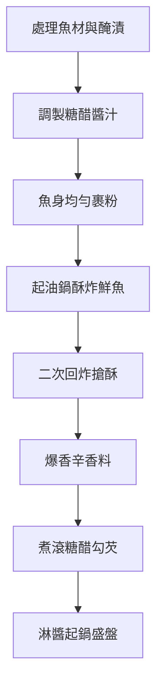

0414第一天上前端課程
1.問題
2.解法
3.相關資料

使用Gemini查糖醋魚製作步驟的標題,用mermaid語法表示.再打入
![[Pasted image 20260414090751.png]]
  

回剛才AI查詢對話,將此糖醋魚生成照片.
使用 SHIFT + WIN +S 螢幕截圖
貼到OBSIDIAN 軟體裡面  CTRL+V貼上

![[Pasted image 20260414090944.png]]